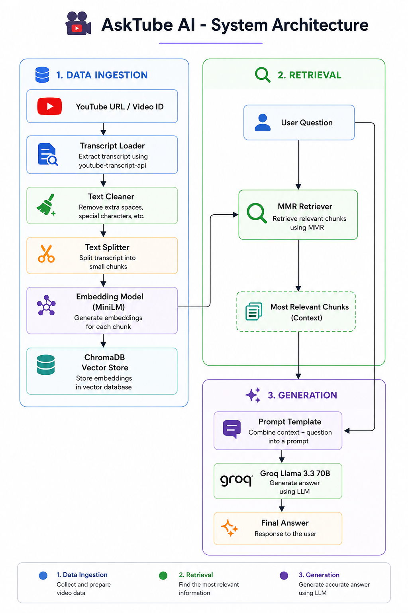

# 🎥 AskTube AI

AskTube AI is a RAG (Retrieval-Augmented Generation) application that allows you to chat with any YouTube video. Simply paste a YouTube URL or Video ID, and the application extracts the transcript, builds a vector database, and answers your questions using an LLM.

## Features

- 🎥 Supports YouTube URLs and Video IDs
- 📝 Extracts video transcripts automatically
- ✂️ Cleans and chunks transcript text
- 🧠 Generates embeddings using Hugging Face
- 📚 Stores embeddings in ChromaDB
- 🔍 Uses MMR retrieval for relevant context
- 🤖 Answers questions using Groq Llama 3.3
- ⚡ Simple and interactive Streamlit interface

## Tech Stack

- **Frontend:** Streamlit
- **LLM Framework:** LangChain
- **LLM:** Groq (Llama 3.3 70B)
- **Embeddings:** `sentence-transformers/all-MiniLM-L6-v2`
- **Vector Database:** ChromaDB
- **Transcript API:** youtube-transcript-api
- **Language:** Python

## Installation

Clone the repository:

```bash
git clone https://github.com/sidvallal/AskTube-AI.git
cd AskTube-AI
```

Create a virtual environment:

```bash
python -m venv venv
```

Activate it:

**Windows**

```bash
venv\Scripts\activate
```

**Linux / macOS**

```bash
source venv/bin/activate
```

Install dependencies:

```bash
pip install -r requirements.txt
```

## Environment Variables

Create a `.env` file in the project root.

```env
GROQ_API_KEY=your_groq_api_key
```

## Run the Project

```bash
streamlit run app.py
```

## Workflow

<p align="center">
  
</p>

### Pipeline

1. User enters a YouTube URL or Video ID.
2. The transcript is extracted using `youtube-transcript-api`.
3. The transcript is cleaned and split into chunks.
4. Chunks are converted into embeddings using **all-MiniLM-L6-v2**.
5. Embeddings are stored in **ChromaDB**.
6. When a question is asked, the **MMR Retriever** finds the most relevant chunks.
7. The retrieved context and user question are combined into a prompt.
8. **Groq Llama 3.3 70B** generates the final answer.
## Author

**Siddharth Vallal**

- GitHub: https://github.com/sidvallal
- LinkedIn: https://www.linkedin.com/in/siddharth-vallal/

---

⭐ If you found this project useful, consider giving it a star.
